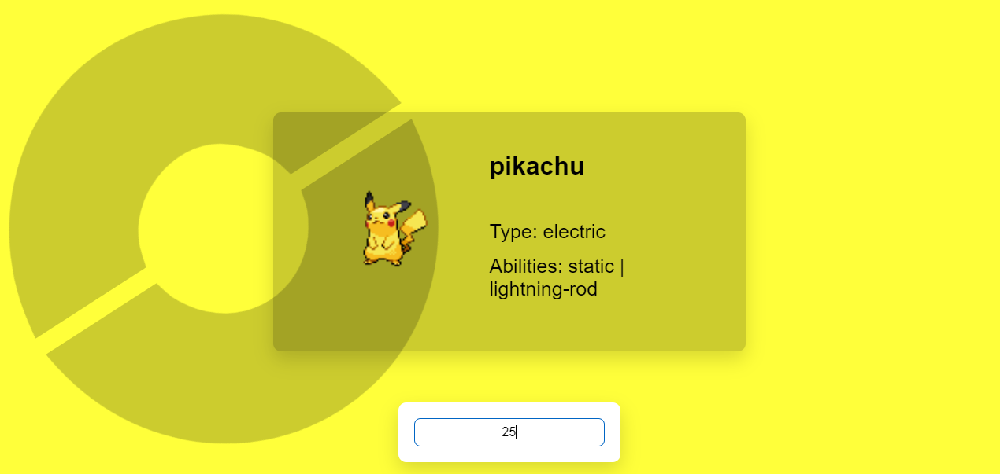

# Simple Pokedex

## Pokemons query

The goal is to create a virtual Pokedex where users can get the following Pokemon information:
- Name
- Image (sprites)
- Abilities
- Use [PokeApi](https://pokeapi.co/docs/v2#pokemon) to search for information.